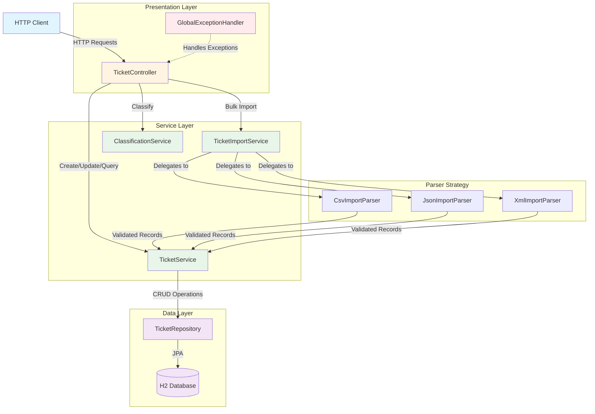
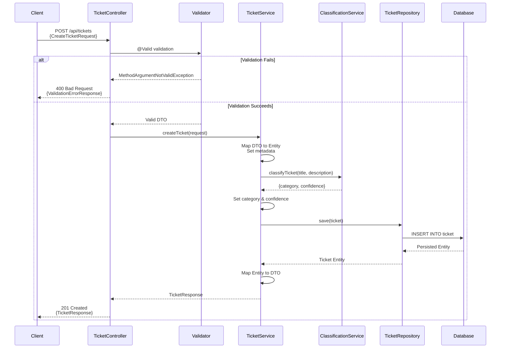
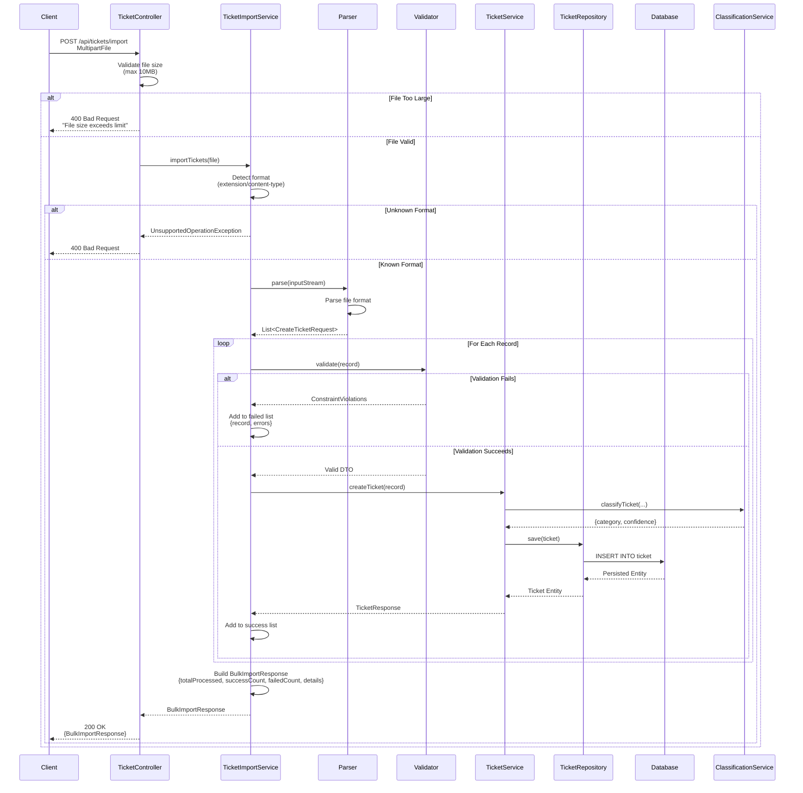

# System Architecture

## Overview

This document describes the architecture of the Support Ticket Management System, a Spring Boot application that provides REST APIs for creating, managing, and classifying support tickets with bulk import capabilities.

---

## 1. High-Level Architecture

The system follows a layered architecture pattern with clear separation of concerns:



### Component Responsibilities

- **TicketController**: REST API endpoints for ticket operations, validation orchestration
- **TicketService**: Business logic for ticket lifecycle management
- **TicketImportService**: Orchestrates bulk import, delegates to format-specific parsers
- **ClassificationService**: Keyword-based ticket classification with confidence scoring
- **Parser Implementations**: Format-specific parsing (CSV, JSON, XML) to domain objects
- **TicketRepository**: Spring Data JPA repository for database operations
- **GlobalExceptionHandler**: Centralized exception handling and error response formatting

---

## 2. Ticket Creation Sequence Diagram

Standard single-ticket creation flow:



### Key Points

- Bean Validation occurs at controller layer before service invocation
- Classification is automatic during ticket creation
- Metadata (created/updated timestamps) is set by service layer
- Database constraints enforced by JPA/Hibernate
- Response DTO prevents internal entity exposure

---

## 3. Bulk Import Sequence Diagram

Multi-format bulk import with partial success support:



### Key Points

- Format detection based on file extension and content type
- Strategy pattern: parser selected dynamically
- Per-record validation: failures don't abort entire batch
- Partial success: successfully imported tickets are committed
- Detailed error reporting: failed records include validation messages
- Transaction boundary: each ticket creation is atomic

---

## 4. Design Decisions

### 4.1 H2 In-Memory Database

**Decision**: Use H2 database in in-memory mode.

**Rationale**:
- No external database setup required (simplifies deployment)
- Fast read/write operations (nanosecond latency)
- Ideal for development, testing, and demo environments
- Schema auto-creation via Hibernate DDL
- Data resets on application restart (acceptable for homework/prototype)

**Trade-offs**:
- Data is not persisted across restarts
- Not suitable for production use
- No concurrent access from multiple application instances
- Limited to JVM heap memory

**Alternative Considered**: PostgreSQL (rejected due to external dependency requirement)

---

### 4.2 Keyword-Based Classification

**Decision**: Implement rule-based keyword matching for ticket classification instead of machine learning.

**Rationale**:
- **Deterministic**: Same input always produces same output
- **Transparent**: Classification rules are explicit and auditable
- **No Training Data Required**: Works immediately without labeled dataset
- **Explainable**: Confidence scores based on keyword match count
- **Low Latency**: In-memory keyword matching (microseconds)
- **Maintainable**: Non-technical users can update keyword lists

**Implementation**:
```
Confidence Score = (matched_keywords / total_keywords_in_category) * 100
Category = category with highest confidence score
```

**Trade-offs**:
- Less accurate than trained ML models on edge cases
- Requires manual keyword curation
- Limited to predefined categories
- Does not learn from historical data

**Alternative Considered**: ML-based classification (rejected due to complexity and training data requirements)

---

### 4.3 Strategy Pattern for Parsers

**Decision**: Use Strategy pattern with format-specific parser implementations.

**Structure**:
- `ImportParser` interface: `List<CreateTicketRequest> parse(InputStream)`
- Implementations: `CsvImportParser`, `JsonImportParser`, `XmlImportParser`
- `TicketImportService` selects parser based on file extension/content-type

**Rationale**:
- **Open/Closed Principle**: New formats can be added without modifying existing code
- **Single Responsibility**: Each parser handles one format
- **Testability**: Parsers can be unit tested independently
- **Uniform Output**: All parsers produce `List<CreateTicketRequest>` for downstream processing

**Example**:
```java
ImportParser parser = switch(fileExtension) {
    case "csv" -> csvImportParser;
    case "json" -> jsonImportParser;
    case "xml" -> xmlImportParser;
    default -> throw new UnsupportedOperationException();
};
List<CreateTicketRequest> records = parser.parse(inputStream);
```

**Alternative Considered**: Single parser with if-else branches (rejected due to poor extensibility)

---

### 4.4 Spring Data JPA Query Methods

**Decision**: Use Spring Data JPA query derivation instead of Specifications for filtering.

**Rationale**:
- **Simplicity**: Limited filter combinations (status, priority, category) don't justify Specification complexity
- **Readability**: Method names clearly express query intent
- **Type Safety**: Compile-time checking of query parameters
- **Performance**: Spring Data generates efficient queries

**Example**:
```java
List<Ticket> findByStatus(TicketStatus status);
List<Ticket> findByPriorityAndCategory(Priority priority, Category category);
```

**Trade-offs**:
- Less flexible for complex dynamic queries
- Method explosion if many filter combinations needed

**Alternative Considered**: Criteria API/Specifications (rejected due to overkill for current requirements)

---

### 4.5 @ElementCollection for Tags

**Decision**: Store tags using `@ElementCollection` annotation.

**Rationale**:
- **Simplicity**: No separate Tag entity or join table management
- **Eager Loading**: Tags loaded with parent ticket (no N+1 queries)
- **Database Schema**: Single collection table (ticket_tags) with foreign key
- **Sufficient for Use Case**: Tags are value objects, not independent entities

**Schema**:
```sql
CREATE TABLE ticket_tags (
    ticket_id BIGINT NOT NULL,
    tag VARCHAR(255),
    FOREIGN KEY (ticket_id) REFERENCES ticket(id)
);
```

**Trade-offs**:
- No tag reuse/normalization (duplicates across tickets)
- Cannot query tags independently
- Cascade operations tied to parent ticket lifecycle

**Alternative Considered**: Separate Tag entity with @ManyToMany (rejected due to unnecessary complexity)

---

### 4.6 @Embedded Metadata

**Decision**: Use `@Embedded` for audit metadata (createdAt, updatedAt, createdBy).

**Rationale**:
- **Single Table**: No join required for metadata access
- **Cohesion**: Metadata is intrinsic to ticket entity
- **Performance**: Avoid join overhead for every query
- **Simplicity**: No separate metadata entity management

**Schema Impact**:
```sql
CREATE TABLE ticket (
    id BIGINT PRIMARY KEY,
    title VARCHAR(255),
    -- other ticket fields --
    created_at TIMESTAMP,
    updated_at TIMESTAMP,
    created_by VARCHAR(255)
);
```

**Alternative Considered**: Separate audit_metadata table (rejected due to unnecessary join overhead)

---

## 5. Security Considerations

### 5.1 Input Validation

**Mechanism**: Jakarta Bean Validation (JSR-380) with custom validators.

**Implementation**:
- `@NotBlank`, `@Size`, `@Pattern` annotations on DTOs
- Custom validators: `@ValidPriority`, `@ValidStatus`
- Controller-level validation via `@Valid` annotation
- Centralized error handling in `GlobalExceptionHandler`

**Example**:
```java
public class CreateTicketRequest {
    @NotBlank(message = "Title is required")
    @Size(max = 255, message = "Title must not exceed 255 characters")
    private String title;

    @ValidPriority
    private String priority;
}
```

**Protection Against**:
- Injection attacks (SQL, XSS) via input sanitization
- Buffer overflow via size constraints
- Invalid state transitions via enum validation

---

### 5.2 SQL Injection Prevention

**Mechanism**: JPA parameterized queries.

**Implementation**:
- Spring Data JPA generates parameterized queries automatically
- No raw SQL concatenation
- Named parameters in custom queries

**Example**:
```java
// Generated query uses parameterization
List<Ticket> findByStatus(TicketStatus status);

// Custom query with named parameter
@Query("SELECT t FROM Ticket t WHERE t.title LIKE :keyword")
List<Ticket> searchByKeyword(@Param("keyword") String keyword);
```

**Note**: Even with user input like `'; DROP TABLE ticket; --`, parameterization treats it as literal string value.

---

### 5.3 File Upload Restrictions

**Configuration**:
```properties
spring.servlet.multipart.max-file-size=10MB
spring.servlet.multipart.max-request-size=10MB
```

**Protection Against**:
- Denial of Service via oversized file uploads
- Memory exhaustion
- Disk space exhaustion

**Additional Validation**:
- Content type checking (text/csv, application/json, application/xml)
- File extension validation
- Malformed file detection during parsing

---

### 5.4 Error Message Sanitization

**Principle**: Error responses do not expose internal implementation details.

**Implementation**:
- Generic error messages for unexpected exceptions
- Stack traces suppressed in production
- Database constraint violations mapped to user-friendly messages
- No file system paths in error responses

**Example**:
```json
{
  "timestamp": "2026-02-04T10:30:00Z",
  "status": 400,
  "error": "Bad Request",
  "message": "Invalid priority value. Must be one of: LOW, MEDIUM, HIGH, CRITICAL",
  "path": "/api/tickets"
}
```

---

## 6. Performance Considerations

### 6.1 In-Memory H2 Database

**Performance Characteristics**:
- Read latency: <1ms (in-process memory access)
- Write latency: <5ms (includes transaction commit)
- No network overhead
- No disk I/O (except optional persistence)

**Benchmarks** (approximate):
- Single ticket creation: ~2-5ms
- Bulk import (100 tickets): ~200-500ms
- Query with filters: <10ms
- Classification: <1ms per ticket

**Limitation**: Performance degrades with large datasets (10,000+ tickets) due to heap memory constraints.

---

### 6.2 Bulk Import with Partial Success

**Design**:
- Per-record validation and transaction
- Failed records do not rollback successful imports
- Parallel processing not implemented (sequential for simplicity)

**Performance Profile**:
- CSV (1,000 records): ~5-10 seconds
- JSON (1,000 records): ~6-12 seconds
- XML (1,000 records): ~8-15 seconds

**Bottlenecks**:
- File parsing (XML slowest due to DOM parsing)
- Individual database commits (N transactions for N records)
- Bean validation per record

**Optimization Opportunities** (not implemented):
- Batch inserts (JDBC batch API)
- Parallel stream processing
- Validation caching for duplicate records

---

### 6.3 Eager Loading Strategy

**Configuration**:
```java
@ElementCollection(fetch = FetchType.EAGER)
private Set<String> tags;

@Embedded
private TicketMetadata metadata;
```

**Rationale**:
- Avoid N+1 query problem (one query per ticket for tags)
- Tags and metadata are always accessed together with ticket
- In-memory database makes join cost negligible

**Query Profile**:
```sql
-- Single query with LEFT JOIN
SELECT t.*, tt.tag, t.created_at, t.updated_at, t.created_by
FROM ticket t
LEFT JOIN ticket_tags tt ON t.id = tt.ticket_id
WHERE t.id = ?
```

**Trade-off**: Slightly larger result sets, but eliminates multiple round-trips.

**Alternative**: Lazy loading with `@EntityGraph` for selective eager loading (rejected due to added complexity for current scale).

---

## 7. Technology Stack

| Layer | Technology | Version | Purpose |
|-------|-----------|---------|---------|
| Framework | Spring Boot | 3.3.6 | Application foundation |
| Web | Spring Web MVC | 6.1.x | REST API endpoints |
| Persistence | Spring Data JPA | 3.3.x | Data access layer |
| Database | H2 Database | 2.2.x | In-memory storage |
| Validation | Hibernate Validator | 8.0.x | Bean validation |
| Build | Gradle | 8.11.1 | Dependency management |
| Runtime | Java | 21+ | Execution environment |

---

## 8. Future Enhancements

### Scalability
- Replace H2 with PostgreSQL for production persistence
- Implement connection pooling (HikariCP)
- Add Redis cache for frequently accessed tickets
- Introduce message queue (RabbitMQ/Kafka) for async processing

### Security
- Add Spring Security with JWT authentication
- Implement role-based access control (RBAC)
- Add audit logging for all mutations
- Implement rate limiting for API endpoints

### Performance
- Batch processing for bulk imports
- Implement pagination for list endpoints
- Add database indexes on frequently queried fields
- Introduce async processing for classification

### Features
- Webhook notifications for ticket updates
- Real-time updates via WebSocket
- Advanced search with full-text indexing (Elasticsearch)
- ML-based classification model integration
- Ticket assignment and workflow management

---

## Conclusion

This architecture prioritizes simplicity, maintainability, and clear separation of concerns while providing a solid foundation for a ticket management system. The use of established patterns (Strategy, Repository, Layered Architecture) and Spring Boot conventions results in a codebase that is easy to understand, test, and extend.

The design decisions optimize for the current requirements (homework/demo) while documenting clear paths for production hardening when needed.
