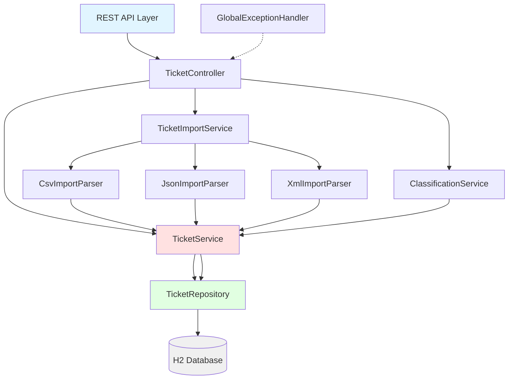

# Intelligent Customer Support System

## Project Overview

The Intelligent Customer Support System is a Spring Boot application designed to manage customer support tickets efficiently. It provides comprehensive ticket management capabilities including CRUD operations, bulk import from multiple file formats, and intelligent auto-classification based on ticket content. The system uses keyword analysis to automatically categorize tickets and assign confidence scores, helping support teams prioritize and route tickets effectively.

## Features

- REST API for ticket CRUD operations (Create, Read, Update, Delete)
- Bulk import from multiple formats (CSV, JSON, XML)
- Keyword-based auto-classification with confidence scoring
- Filtering by category, priority, and status
- Metadata support for device information and geographic data
- H2 in-memory database for rapid development and testing
- Comprehensive test coverage with unit and integration tests

## Architecture Diagram



## Prerequisites

- Java 17 or higher
- Gradle 8.7 or higher

## Quick Start

### Build the Project

```bash
./gradlew build
```

### Run the Application

```bash
./gradlew bootRun
```

The application will start and be accessible at `http://localhost:8080`

### Access H2 Database Console

Navigate to `http://localhost:8080/h2-console` in your browser.

Connection details:
- JDBC URL: `jdbc:h2:mem:supportdb`
- Username: `sa`
- Password: (leave empty)

## Running Tests

### Run All Tests

```bash
./gradlew test
```

### Generate Code Coverage Report

```bash
./gradlew jacocoTestReport
```

The coverage report will be available at `build/reports/jacoco/test/html/index.html`

## Project Structure

```
homework-2/
├── build.gradle
├── settings.gradle
├── src/main/java/com/support/ticket/
│   ├── TicketApplication.java
│   ├── config/WebConfig.java
│   ├── controller/TicketController.java
│   ├── dto/
│   │   ├── CreateTicketRequest.java
│   │   ├── UpdateTicketRequest.java
│   │   ├── TicketResponse.java
│   │   ├── BulkImportResponse.java
│   │   ├── ClassificationResult.java
│   │   └── MetadataRequest.java
│   ├── exception/
│   │   ├── GlobalExceptionHandler.java
│   │   ├── TicketNotFoundException.java
│   │   └── ImportException.java
│   ├── model/
│   │   ├── Ticket.java
│   │   ├── TicketMetadata.java
│   │   ├── Category.java
│   │   ├── Priority.java
│   │   ├── Status.java
│   │   ├── Source.java
│   │   └── DeviceType.java
│   ├── repository/TicketRepository.java
│   └── service/
│       ├── TicketService.java
│       ├── TicketImportService.java
│       ├── ClassificationService.java
│       └── parser/
│           ├── CsvImportParser.java
│           ├── JsonImportParser.java
│           └── XmlImportParser.java
├── src/main/resources/application.properties
├── src/test/java/com/support/ticket/
│   ├── controller/
│   │   ├── TicketControllerTest.java
│   │   └── TicketControllerValidationTest.java
│   ├── model/
│   │   └── TicketTest.java
│   ├── service/
│   │   ├── TicketServiceTest.java
│   │   ├── ClassificationServiceTest.java
│   │   ├── CsvImportParserTest.java
│   │   ├── JsonImportParserTest.java
│   │   └── XmlImportParserTest.java
│   └── integration/
│       └── TicketIntegrationTest.java
├── src/test/resources/fixtures/
│   ├── valid_tickets.csv
│   ├── valid_tickets.json
│   ├── valid_tickets.xml
│   ├── invalid_tickets.csv
│   ├── invalid_tickets.json
│   └── invalid_tickets.xml
├── sample_tickets.csv (50 tickets)
├── sample_tickets.json (20 tickets)
└── sample_tickets.xml (30 tickets)
```

## API Endpoints

### Ticket Management

- `GET /api/tickets` - Get all tickets (supports filtering by category, priority, status)
- `GET /api/tickets/{id}` - Get ticket by ID
- `POST /api/tickets` - Create a new ticket
- `PUT /api/tickets/{id}` - Update an existing ticket
- `DELETE /api/tickets/{id}` - Delete a ticket

### Bulk Import

- `POST /api/tickets/import/csv` - Import tickets from CSV file
- `POST /api/tickets/import/json` - Import tickets from JSON file
- `POST /api/tickets/import/xml` - Import tickets from XML file

### Classification

- `POST /api/tickets/{id}/classify` - Classify a ticket and update its category

## Technology Stack

- Java 17
- Spring Boot 3.2.5
- Spring Data JPA
- H2 Database (in-memory)
- Gradle 8.7
- JUnit 5
- Mockito
- Jackson (JSON/XML processing)
- Apache Commons CSV

## Development

### Adding New Features

1. Define models in `model/` package
2. Create repository interfaces in `repository/` package
3. Implement business logic in `service/` package
4. Expose endpoints through `controller/` package
5. Add comprehensive tests in `src/test/`

### Code Quality

The project maintains high code quality standards:
- Comprehensive unit tests for all service components
- Integration tests for API endpoints
- Code coverage reports via JaCoCo
- Input validation using Bean Validation
- Centralized exception handling

## Contributing

When contributing to this project:
1. Ensure all tests pass before committing
2. Add tests for new features
3. Follow existing code structure and naming conventions
4. Update documentation as needed

## License

This project is part of the AI Coding Partner Homework assignment.
