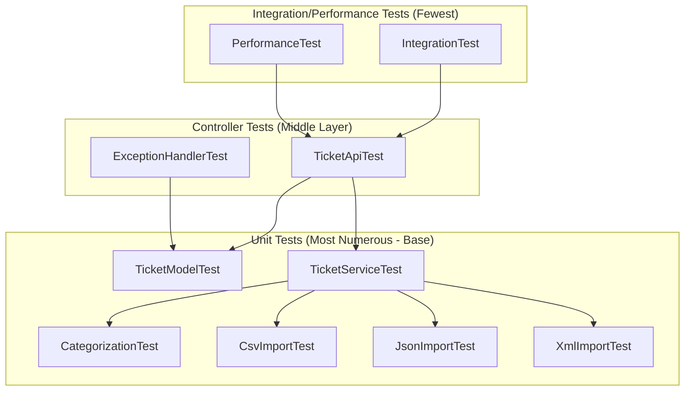

# Testing Guide

**Audience**: QA engineers running and extending the test suite

This guide covers the complete test suite for the Support Ticket Management System, including how to run tests, understand the test structure, and verify system behavior.

## Test Pyramid Diagram



## Running Tests

### All Tests
```bash
./gradlew test
```

### Single Test Class
```bash
./gradlew test --tests "com.support.ticket.model.TicketModelTest"
```

### Specific Test Method
```bash
./gradlew test --tests "com.support.ticket.controller.TicketApiTest.testCreateTicket"
```

### Coverage Report
```bash
./gradlew jacocoTestReport
```
Then open `build/reports/jacoco/test/html/index.html` in your browser.

**Current Coverage**: >91% line coverage

### Test Output Location
- Test results: `build/reports/tests/test/index.html`
- Coverage report: `build/reports/jacoco/test/html/index.html`
- Test XML reports: `build/test-results/test/`

## Test File Summary

| Test File | Type | Tests | What It Tests |
|-----------|------|-------|---------------|
| TicketApiTest | @WebMvcTest | 11 | REST endpoint HTTP status, request/response |
| ExceptionHandlerTest | @WebMvcTest | 4 | Error handling, malformed input |
| TicketModelTest | Unit | 9 | Bean Validation constraints |
| TicketServiceTest | Unit | 10 | Service layer logic, metadata, enum coverage |
| CategorizationTest | Unit | 10 | Classification keywords, priority detection |
| CsvImportTest | Unit | 6 | CSV parsing, edge cases |
| JsonImportTest | Unit | 5 | JSON parsing, edge cases |
| XmlImportTest | Unit | 5 | XML parsing, edge cases |
| IntegrationTest | @SpringBootTest | 5 | End-to-end workflows |
| PerformanceTest | @SpringBootTest | 5 | Timing thresholds, concurrency |

## Test Fixture Locations

All test fixtures are located in `src/test/resources/fixtures/`:

### Valid Fixtures
- `valid_tickets.csv` - 5 valid tickets covering different categories and priorities
- `valid_tickets.json` - 3 valid tickets in JSON format
- `valid_tickets.xml` - 2 valid tickets in XML format

### Invalid Fixtures
- `invalid_tickets.csv` - tickets with invalid data (bad emails, invalid categories)
- `invalid_tickets.json` - tickets with missing required fields
- `invalid_tickets.xml` - tickets with missing required elements

### Malformed Fixtures
- `malformed.csv` - badly formatted CSV (wrong column count, unparseable data)
- `malformed.xml` - invalid XML structure (unclosed tags, malformed syntax)

## Manual Testing Checklist

### POST /tickets - Create Ticket
- [ ] Valid ticket creation with all required fields
- [ ] Missing required field (title)
- [ ] Missing required field (description)
- [ ] Missing required field (customerEmail)
- [ ] Invalid email format
- [ ] Invalid category value
- [ ] Invalid priority value
- [ ] Invalid status value
- [ ] Verify auto-classification on creation
- [ ] Verify createdAt timestamp is set
- [ ] Verify default status is NEW

### POST /tickets/import - Bulk Import
- [ ] Valid CSV file import
- [ ] Valid JSON file import
- [ ] Valid XML file import
- [ ] Empty file handling
- [ ] Malformed CSV file
- [ ] Malformed JSON file
- [ ] Malformed XML file
- [ ] Mixed valid/invalid records in CSV
- [ ] Large file import (500+ rows)
- [ ] Unsupported file format
- [ ] Missing file parameter

### GET /tickets - List Tickets
- [ ] Get all tickets (no filters)
- [ ] Filter by category=TECHNICAL
- [ ] Filter by category=BILLING
- [ ] Filter by category=ACCOUNT
- [ ] Filter by category=GENERAL
- [ ] Filter by priority=HIGH
- [ ] Filter by priority=MEDIUM
- [ ] Filter by priority=LOW
- [ ] Filter by status=NEW
- [ ] Filter by status=IN_PROGRESS
- [ ] Filter by status=RESOLVED
- [ ] Filter by status=CLOSED
- [ ] Combined filters (category + priority)
- [ ] Combined filters (category + status)
- [ ] Combined filters (priority + status)
- [ ] Combined filters (all three)
- [ ] Invalid filter values return 400
- [ ] Empty result set handling

### GET /tickets/{id} - Get Single Ticket
- [ ] Valid ID returns ticket
- [ ] Non-existent ID returns 404
- [ ] Invalid ID format handling
- [ ] Verify all fields in response

### PUT /tickets/{id} - Update Ticket
- [ ] Valid update with all fields
- [ ] Partial update (only title)
- [ ] Partial update (only description)
- [ ] Partial update (only status)
- [ ] Partial update (only priority)
- [ ] Partial update (only category)
- [ ] Non-existent ID returns 404
- [ ] Invalid data returns 400
- [ ] Invalid email format
- [ ] Invalid enum values
- [ ] Verify updatedAt timestamp changes

### DELETE /tickets/{id} - Delete Ticket
- [ ] Valid delete returns 204
- [ ] Non-existent ID returns 404
- [ ] Verify ticket is removed from database
- [ ] Subsequent GET returns 404

### POST /tickets/{id}/auto-classify - Auto-Classification
- [ ] Technical keywords trigger TECHNICAL category
- [ ] Billing keywords trigger BILLING category
- [ ] Account keywords trigger ACCOUNT category
- [ ] No keywords default to GENERAL
- [ ] Urgent keywords set HIGH priority
- [ ] Default to MEDIUM priority
- [ ] Non-existent ticket returns 404
- [ ] Verify classification result in response

## Performance Benchmark Thresholds

| Benchmark | Threshold | Description |
|-----------|-----------|-------------|
| 100 ticket creations | < 2 seconds | Sequential POST requests |
| 500-row CSV import | < 5 seconds | Single bulk import |
| List 1000 tickets | < 1 second | GET with data pre-loaded |
| 20 concurrent POSTs | All succeed | ExecutorService threads |
| 50 classifications | < 3 seconds | Sequential auto-classify |

### Running Performance Tests

Performance tests are part of the test suite but can be run separately:

```bash
./gradlew test --tests "com.support.ticket.integration.PerformanceTest"
```

**Note**: Performance tests may take 15-30 seconds to complete due to the nature of timing measurements.

## Adding New Tests

### Unit Test Template
```java
@Test
public void testYourFeature() {
    // Arrange
    // Set up test data and expectations

    // Act
    // Execute the code under test

    // Assert
    // Verify the results
}
```

### Controller Test Template
```java
@WebMvcTest(TicketController.class)
public class YourControllerTest {
    @Autowired
    private MockMvc mockMvc;

    @MockBean
    private TicketService ticketService;

    @Test
    public void testEndpoint() throws Exception {
        mockMvc.perform(get("/your-endpoint"))
            .andExpect(status().isOk());
    }
}
```

### Integration Test Template
```java
@SpringBootTest(webEnvironment = SpringBootTest.WebEnvironment.RANDOM_PORT)
public class YourIntegrationTest {
    @Autowired
    private TestRestTemplate restTemplate;

    @Test
    public void testEndToEnd() {
        // Test complete workflow
    }
}
```

## Test Naming Conventions

- Test methods should start with `test` prefix
- Use descriptive names: `testCreateTicketWithValidData`
- Negative tests: `testCreateTicketWithInvalidEmail`
- Edge cases: `testImportEmptyFile`

## Continuous Integration

Tests are automatically run on:
- Every commit (if CI is configured)
- Pull request creation
- Before deployment

Ensure all tests pass before submitting code for review.

## Troubleshooting

### Tests Failing Locally
1. Clean build: `./gradlew clean test`
2. Check Java version: `java -version` (should be 17+)
3. Verify no application instance is running on port 8080
4. Check test fixtures exist in `src/test/resources/fixtures/`

### Performance Tests Timing Out
- Performance thresholds may vary by machine
- Run performance tests multiple times to account for variance
- Consider system load when evaluating results

### Coverage Not Updating
1. Run: `./gradlew clean`
2. Run: `./gradlew test jacocoTestReport`
3. Refresh browser or clear cache

## Best Practices

1. **Run tests before committing**: Always run the full test suite locally
2. **Keep tests independent**: Each test should be self-contained
3. **Use meaningful assertions**: Verify specific behavior, not just "not null"
4. **Test edge cases**: Empty inputs, null values, boundary conditions
5. **Maintain fixtures**: Keep test data realistic and up-to-date
6. **Document complex tests**: Add comments explaining non-obvious test logic
7. **Update thresholds carefully**: Performance thresholds should reflect real requirements

## Contact

For questions about the test suite or to report test issues, contact the development team.
